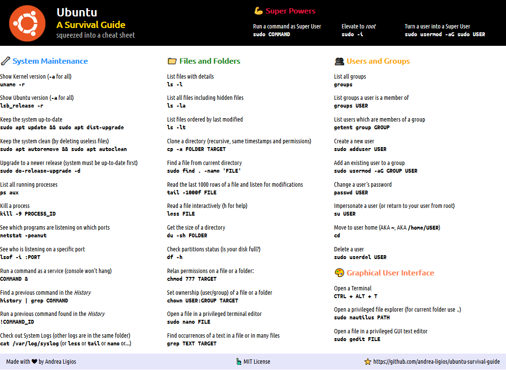

# Ubuntu Survival Guide

> A humble Cheat Sheet to save the poor noob's day

## Instructions

1. Download as .ZIP, extract the `/assets` folder, then open `ubuntu-survival-guide.html` with a decent browser; it should look like follows:

   <kbd></kbd>

2. Run a **Print Preview**, select the **landscape** orientation, remove all **margins**, remove all **infos**, allow the printer to **print background images and colors**, then finally click the **Print** button for good
3. Take always with you on your Ubuntu journeys, enjoy
