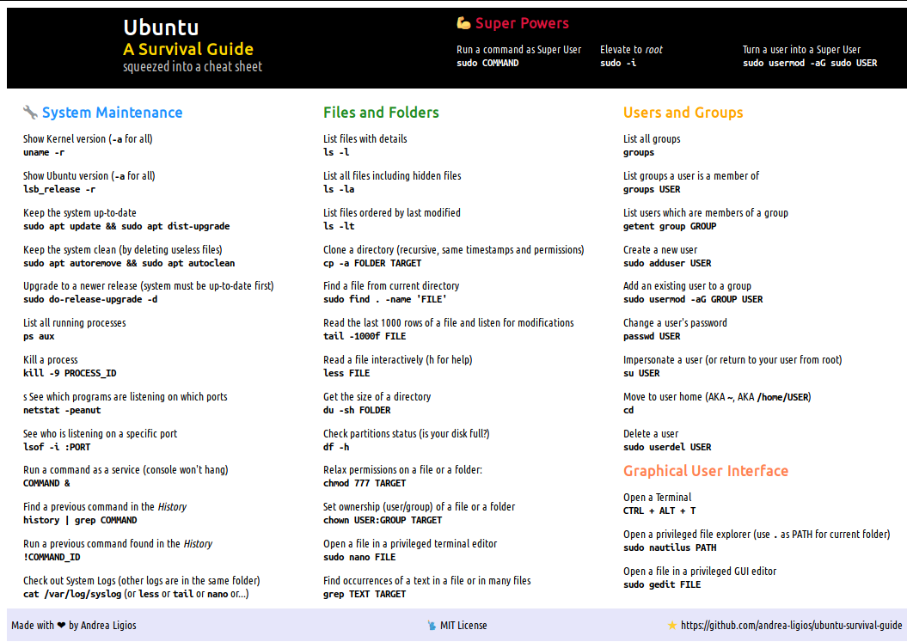

# Ubuntu Survival Guide

> A humble Cheat Sheet to save the poor noob's day

## Instructions

1. Download the `/assets` folder, then open the `.html` file with a decent browser; it should look like follows:

   

2. Print Preview, set **landscape** orientation, remove all **margins**, remove all **infos**, click Print, allow the printer to **print background images and colors**, then finally click the Print button for good
3. Take always with you on your Ubuntu journeys
4. Enjoy
